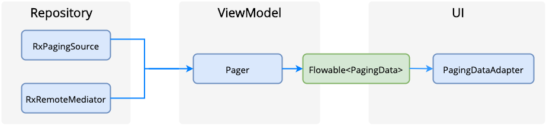
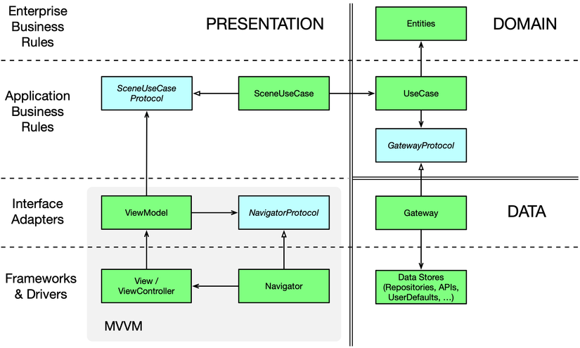

<h1 align="center"> IMStudio </h1>

<p align="center">
<a>
    
    
    
    
    
</a>
<br/>
<br/>
    <a href="https://imstudio.medium.com/" target="_blank">
        
    </a>
</p>

[](#table-of-contents)

## 📖 Table of Contents

- [Project Structure](#project-structure)
- [Convention](#convention)
- [RxJava](#rxjava)
- [Common Scripts](#scripts)
- [Technical Stack](#technical-stack)
- [Dependencies](#dependencies)
- [Library](#library)
- [Architecture](#architecture)
- [Case Study](#case-study)
- [Authors](#authors)

## Architecture Component


## Architecture Paging


## Clean Architecture


## 🌈 Git Flow

---
### Flow
 1. Pull newest code from develop branch
 2. Create new branch from develop branch
 3. Code, test on new branch. Make sure that all feature is true and have no error
 4. Pull newest code from develop branch again, merge into new branch
 5. Create merge request

### Commit Rules
- [x] feat (new feature for the user, not a new feature for build script)
- [x] fix (bug fix for the user, not a fix to a build script)
- [x] docs (changes to the documentation)
- [x] style (formatting, missing semi colons, etc; no production code change)
- [x] refactor (refactoring production code, eg. renaming a variable)
- [x] test (adding missing tests, refactoring tests; no production code change)
- [x] chore (updating grunt tasks etc; no production code change)
### Example: create new feature branch
1. Branch name: feature/{feature_name}
2. Commit message describe core of commit change. Start with:
- [x] feature: description
- [x] fix: description
- [x] refactor: Refactoring source code, optimize source code...

<details><summary><b>RxJava</b></summary>

### Common UseCase (if you do not know about observable and observer, pleas stop here)

- **Single**: is an asynchronously retrieved: one-shot value
- **Observable**: class that emits a stream of data or events. i.e. a class that can be used to perform some action, and publish the result: streams of data
- **Flowable**: streams of data
- **Observer**: class that receivers the events or data and acts upon it. i.e. a class that waits and watches the Observable, and reacts whenever the Observable publishes results.

### Subject (like above, please stop here)

- **Publish Subject**: It emits all the subsequent items of the source Observable at the time of subscription.
- **Replay Subject**: It emits all the items of the source Observable, regardless of when the subscriber subscribes.
- **Behavior Subject**: It emits the most recently emitted item and all the subsequent items of the source Observable when an observer subscribes to it.
- **Async Subject**: It only emits the last value of the source Observable(and only the last value) only after that source Observable completes.
</details>

<details><summary><b>Scripts</b></summary>

**Clear build folder**

```bash
    find . -name build -exec rm -rf {} \;
```
```bash
    find . -name build -exec rm -r "{}" \;
```
Gradle
```gradle
task clean(type: Delete) {
    delete rootProject.buildDir
}
```

**Remove all DS_Store**

```bash
    find . -name '.DS_Store' -type f -delete
```

```bash
    find . -name ".DS_Store" -type d -exec rm -r "{}" \;
```

```bash
    find . -name ".hprof" -type d -exec rm -r "{}" \;
```

**Remove all iml**

```bash
    find . -name '.iml' -type f -delete
```

**Clear cache**

```bash
    git rm -r --cached .idea | git rm -r --cached *.iml
```

**Dependencies**

```bash
    ./gradlew -q dependencies [module]:dependencies
```

**Pull with rebase default**

```bash
    git config --global pull.rebase true
```

</details>

## 🌈 Technical Stack

This project takes advantage of many popular libraries, plugins and tools of the Android ecosystem. Most of the libraries are in the stable version, unless there is a good reason to use non-stable dependency.

The architecture is built around Android Architecture Components.

We followed the recommendations laid out in the Guide to App Architecture when deciding on the architecture for the app. We kept logic away from Activities and Fragments and moved it to ViewModels. We observed data using LiveData and used the Data Binding Library to bind UI components in layouts to the app's data sources.

We used a Repository layer for handling data operations. FUTA's data comes from a few different sources - user data is stored in Cloud Firestore (either remotely or in a local cache for offline use), user preferences and settings are stored in SharedPreferences, conference data is stored remotely and is fetched and stored in memory for the app to use, etc. - and the repository modules are responsible for handling all data operations and abstracting the data sources from the rest of the app (we liked using Firestore, but if we wanted to swap it out for a different data source in the future, our architecture allows us to do so in a clean way).

### Kotlin

[](https://kotlinlang.org/)

We made an early decision to rewrite the app from scratch to bring it in line with our thinking about modern Android architecture. Using Kotlin for the rewrite was an easy choice: we liked Kotlin's expressive, concise, and powerful syntax; we found that Kotlin's support for safety features for nullability and immutability made our code more resilient; and we leveraged the enhanced functionality provided by Android Ktx extensions.

## 🎨 Dependencies

- [Jetpack](https://developer.android.com/jetpack):
  - [Android KTX](https://developer.android.com/kotlin/ktx.html) - provide concise, idiomatic Kotlin to Jetpack and Android platform APIs.
  - [AndroidX](https://developer.android.com/jetpack/androidx) - major improvement to the original Android [Support Library](https://developer.android.com/topic/libraries/support-library/index), which is no longer maintained.
  - [Data Binding](https://developer.android.com/topic/libraries/data-binding/) - allows you to bind UI components in your layouts to data sources in your app using a declarative format rather than programmatically.
  - [View Binding](https://developer.android.com/topic/libraries/view-binding/) - View binding is a feature that allows you to more easily write code that interacts with views. Once view binding is enabled in a module, it generates a binding class for each XML layout file present in that module. An instance of a binding class contains direct references to all views that have an ID in the corresponding layout.
  - [Lifecycle](https://developer.android.com/topic/libraries/architecture/lifecycle) - perform actions in response to a change in the lifecycle status of another component, such as activities and fragments.
  - [LiveData](https://developer.android.com/topic/libraries/architecture/livedata) - lifecycle-aware, meaning it respects the lifecycle of other app components, such as activities, fragments, or services.
  - [Navigation](https://developer.android.com/guide/navigation/) - helps you implement navigation, from simple button clicks to more complex patterns, such as app bars and the navigation drawer.
  - [Paging](https://developer.android.com/topic/libraries/architecture/paging/) - helps you load and display small chunks of data at a time. Loading partial data on demand reduces usage of network bandwidth and system resources.
  - [ViewModel](https://developer.android.com/topic/libraries/architecture/viewmodel) - designed to store and manage UI-related data in a lifecycle conscious way. The ViewModel class allows data to survive configuration changes such as screen rotations.
  - [Worker](https://developer.android.com/reference/androidx/work/Worker) - A class that performs work synchronously on a background thread provided by WorkManager.
- [Dagger2](https://dagger.dev/) - dependency injector for replacement all FactoryFactory classes.
- [Retrofit](https://square.github.io/retrofit/) - type-safe HTTP client.
- [Timber](https://github.com/JakeWharton/timber) - a logger with a small, extensible API which provides utility on top of Android's normal Log class.
- [Stetho](http://facebook.github.io/stetho/) - debug bridge for applications via Chrome Developer Tools.
- [Shimmer](https://github.com/facebook/shimmer-android) - Shimmer is an Android library that provides an easy way to add a shimmer effect to any view in your Android app.
- [Glide](https://github.com/bumptech/glide) - Glide is a fast and efficient open source media management and image loading framework for Android that wraps media decoding, memory and disk caching, and resource pooling into a simple and easy to use interface.

## ⚙️ Copyright
```
Created by $username on $today
Copyright (c) $today.year . All rights reserved.
Last modified $file.lastModified
```


[](#table-of-contents)

## 🚀Authors

https://github.com/nphau
https://nphau.medium.com